# 📊 The Context Window

A multi-agent Business Intelligence system that turns raw e-commerce sales data into an automated weekly report — no manual analysis required.

Built solo as a Cohort 2 Capstone Project.

---

## What It Does

Every week, someone normally has to manually dig through sales data to answer: *"How is the business actually doing?"* That takes about an hour of spreadsheet work.

**The Context Window automates this end-to-end.** Feed it raw sales data, and a system of AI agents work together to load it, analyze it, and write a plain-English report — complete with trend detection, anomaly flagging, and week-over-week memory. You can then ask it follow-up questions, all grounded strictly in real data with zero hallucination.

```
Data Fetcher → MCP Verify → [Parallel: Trend | Category | Anomaly Analysis] → Combine Findings → Report Writer → Q&A Layer
```

---

## Architecture

| Component | Role |
|---|---|
| **Data Fetcher** (`agents/data_fetcher.py`) | Loads and joins raw CSVs, cleans bad data, validates quality |
| **MCP Verify** (`mcp_servers/`) | A FastMCP data-quality server — real MCP client/server calls checking nulls, duplicates, freshness. Every tool call is error-wrapped, and the client has a circuit breaker that stops calling further tools after repeated failures |
| **Insight Analyser** (`agents/insight_analyser.py`) | Finds statistically significant trends, category performance shifts, and anomalies (z-score based). Its 3 analysis functions run as a genuine **parallel fan-out/fan-in branch** in LangGraph, since none of them depend on each other |
| **Report Writer** (`agents/report_writer.py`) | Generates a short AI-written Summary + Recommendations via Groq (Llama 3.3), with retry logic, a graceful fallback if the API is unavailable, and a hallucination guardrail that verifies every number against source data. The full findings list is rendered as a structured table directly from data — not restated in AI prose |
| **Q&A Layer** (`agents/qa_agent.py`) | Answers follow-up questions, grounded in the same findings, memory-aware for historical questions with explicit source citations, same retry/fallback reliability as the Report Writer |
| **Memory** (`memory/memory_store.py`) | ChromaDB — stores every report (plus its performance stats and total revenue) as an embedding, enabling week-over-week comparison, semantic search, and persistent cross-session monitoring |
| **Orchestration** (`graph.py`) | LangGraph — wires all agents into one pipeline: sequential where there's a real data dependency, parallel where there isn't |
| **UI** (`app/streamlit_app.py`) | Streamlit app with 3 tabs — Pipeline (run + Q&A), Monitoring (cost/latency over time), Report History (revenue trend, semantic search, full archive) |
| **Export** (`integrations/slack_export.py`) | Download report as `.md`, or send to Slack via webhook |

---

## Tech Stack

`LangGraph` · `FastMCP` · `ChromaDB` · `Groq (Llama 3.3 70B)` · `SQLite` · `Streamlit` · `pandas` · `requests`

---

## Orchestration Pattern

The pipeline is **deliberately mixed**, not uniformly sequential or uniformly parallel:

- **Sequential** where there's a genuine data dependency: Data Fetcher must finish before Insight Analyser can run (Analyser needs clean data); Insight Analyser must finish before Report Writer runs (Writer needs findings).
- **Parallel** where there isn't: the 3 analysis functions (trend detection, category performance, anomaly detection) only depend on the same clean dataset, not on each other — so they run as a true LangGraph fan-out/fan-in branch. Verified live via timestamped logs showing the 3 branches starting in a different order each run and finishing independently, not in a fixed sequence.

This is a "pattern matches the use case, not just convenience" decision — sequential where required, parallel where it genuinely helps.

---

## Guardrails

- **Significance thresholds** — tiny, noisy category swings are filtered out before they ever reach the report
- **Skip-if-nothing-found** — if the Analyser finds nothing significant, the LLM is never called; avoids the model inventing content
- **Hallucination check** — every number in the generated report is verified against the source findings after generation
- **Q&A grounding** — follow-up answers reuse the same number-verification guardrail as the main report
- **Facts vs. narrative separation** — the findings table is rendered directly from structured data (deterministic, can't hallucinate); the AI only writes the Summary and Recommendations, the parts that genuinely need natural language

---

## Reliability & Error Handling

Built against the "fail loudly, don't guess quietly" principle:

- **Retry with backoff** — Groq API calls (Report Writer, Q&A Agent) retry up to 3 times with exponential backoff before giving up
- **Graceful fallback, not a crash** — if Groq is genuinely unavailable after retries, the Report Writer falls back to a plain listing of the raw findings (clearly labeled "Fallback Mode") instead of crashing the pipeline; the Q&A Agent returns a clear "service unavailable" message instead of an unhandled exception
- **MCP tool error handling** — every tool in the data-quality MCP server is wrapped in try/except and returns a clean `ERROR: ...` string rather than crashing the server on a bad table/column name
- **Circuit breaker** — the MCP client stops calling further tools after 2 consecutive failures, marking the rest as `SKIPPED` rather than continuing to hammer a server that's clearly down
- **Slack export failure handling** — a misconfigured or invalid webhook returns a clear error message in the UI rather than crashing the export flow
- **RAG source citations** — when the Q&A Agent or the History tab's search box uses memory, it cites the exact `run_id` and date of the report(s) used
- **Metadata filtering** — semantic search can be constrained to a recent time window instead of surfacing stale matches purely by similarity
- **Cost/latency tracking** — every Groq call logs real, measured latency and token usage (not estimated), persisted in ChromaDB for cross-session monitoring

---

## What Broke (and How We Fixed It)

Eleven real bugs were found and fixed during development:

1. **Phantom -100% crash** — an incomplete trailing month in the raw data made revenue look like it had crashed. Fixed by detecting and dropping partial reporting periods.
2. **Noisy findings** — the first working version produced 39 findings per run, mostly meaningless swings in tiny categories. Tuned thresholds down to a focused, meaningful 11.
3. **Hidden crashes** — the eval suite caught a filter that was accidentally hiding genuine crash-to-near-zero findings because it required *both* the before and after values to clear a minimum threshold. Fixed the logic to only check the prior value.
4. **False-positive hallucination flags** — the number-checker was flagging real numbers as "hallucinated" because `+18.4%` in the data and `18.4%` in the prose weren't recognized as the same number. Fixed by normalizing signs before comparison.
5. **Dates misread as numbers** — the same checker was grabbing fragments like `-08` out of dates like `2018-08` and treating them as invented numbers. Fixed by excluding date patterns before number extraction.
6. **Orphaned function after a refactor** — a mid-file edit accidentally deleted a function signature, leaving its body attached to nothing. The eval suite caught this immediately on the next run — direct proof the eval suite earns its keep beyond the initial build.
7. **No error boundaries on external calls** — an early version had no retry/fallback logic around the Groq API or MCP tool calls; a single failed request would crash the entire pipeline. Added retry-with-backoff, a fallback report path, MCP-side error wrapping, and a circuit breaker.
8. **ChromaDB metadata filter type mismatch** — date-range filtering (`$gte`) failed because ChromaDB's numeric comparison operators don't work on date strings. Fixed by storing a parallel Unix-timestamp field for filtering.
9. **Currency formatting collided with Markdown's LaTeX rendering** — Streamlit's `st.markdown()` interprets text between `$` signs as LaTeX math, which mangled currency figures like `R$1,049.37`. Fixed by escaping dollar signs before rendering.
10. **Concurrent state writes in the parallel branch** — LangGraph rejected the first parallel implementation because all 3 branches were returning the full state object, causing simultaneous writes to unrelated shared keys. Fixed by having each branch return only the key it actually updates.
11. **ChromaDB embedding model download fragility** — the sentence-embedding model ChromaDB uses can fail to download cleanly depending on network conditions, producing a corrupted-file error rather than a clear one. Documented as a known environment-dependent failure mode; resolved by clearing the local model cache and retrying.

---

## Screenshots

The full pipeline running end-to-end in the Streamlit UI:

| | |
|---|---|
| 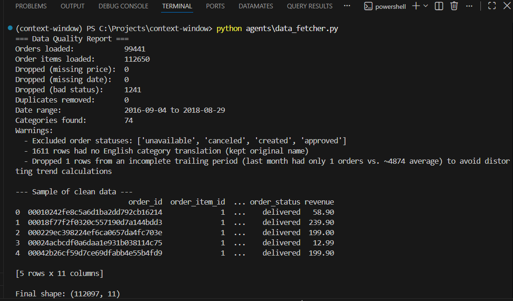 | 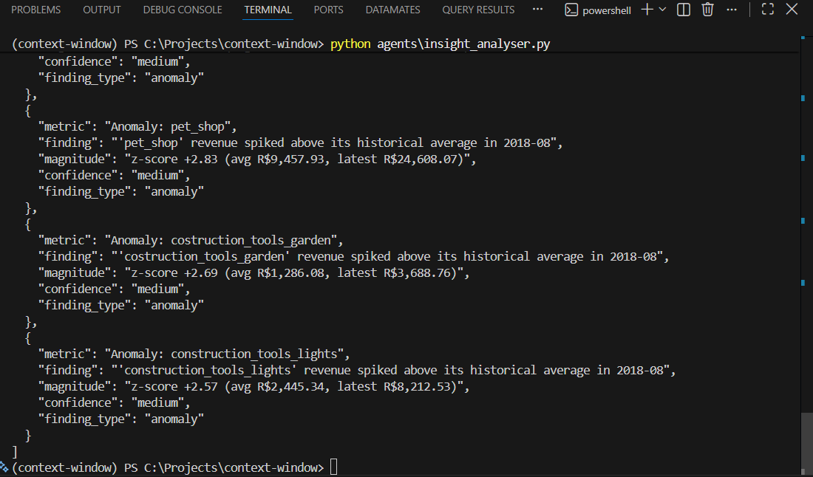 |
| 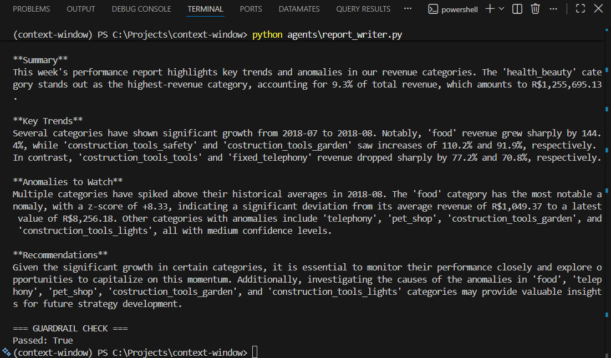 | 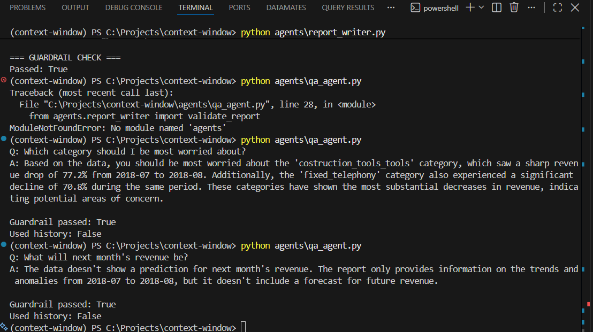 |
| 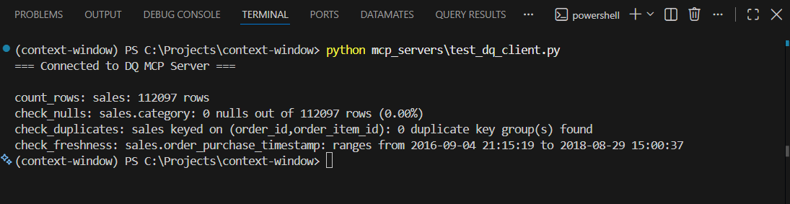 | 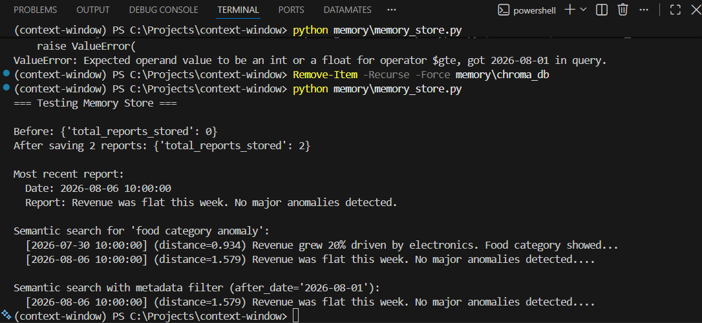 |
| 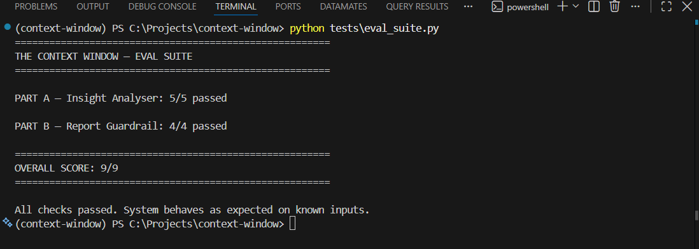 | 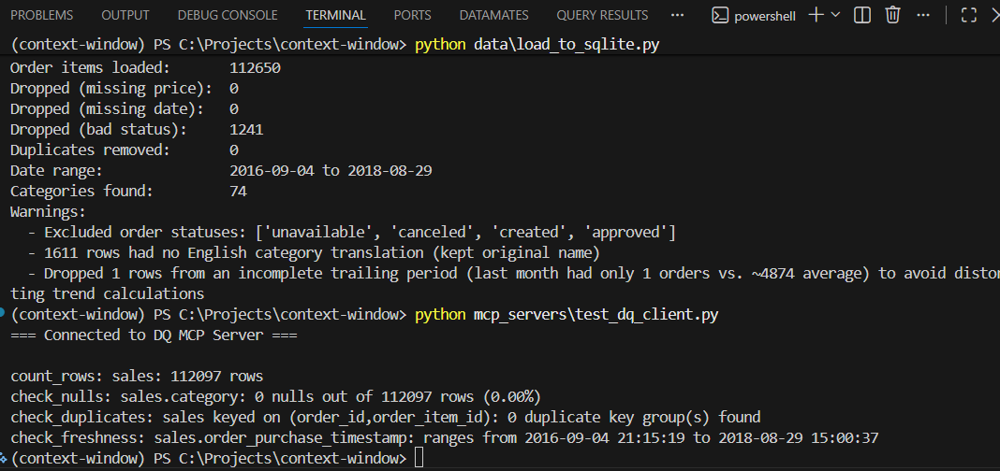 |
| 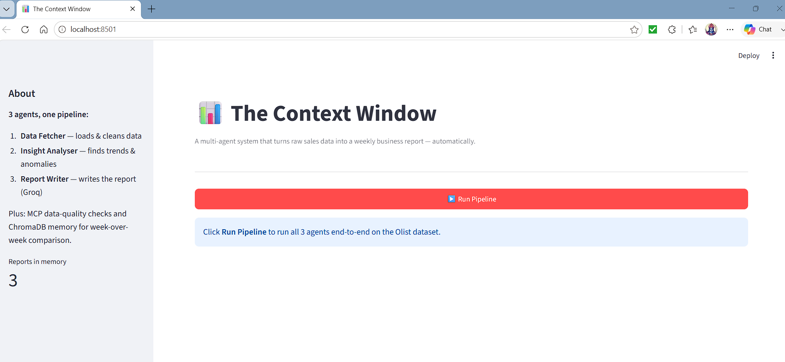 | 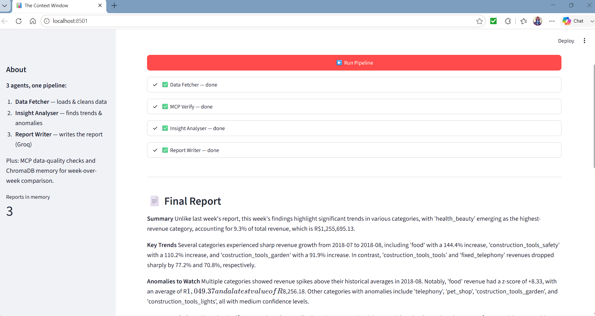 |
| 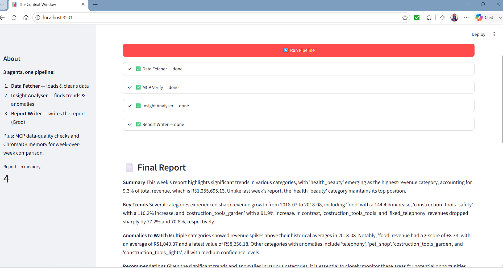 | 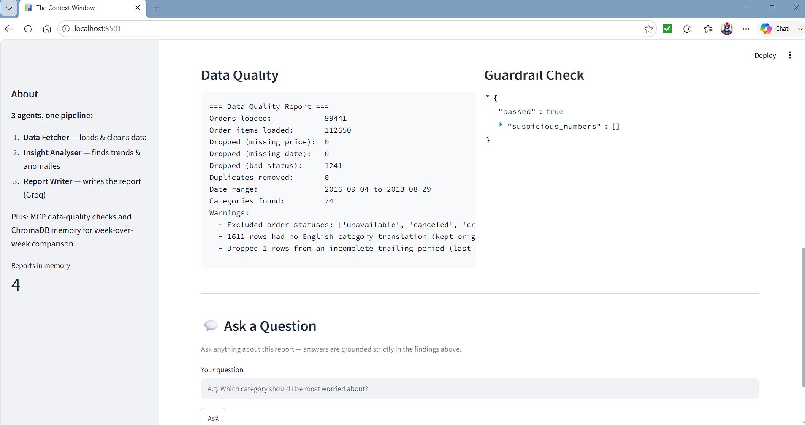 |

---

## Eval Suite — 9/9

A synthetic dataset with deliberately planted, known outcomes proves the system behaves correctly:

- Planted revenue spike → correctly detected as both a trend and a statistical anomaly
- Planted revenue crash → correctly detected
- Noisy, tiny category → correctly ignored
- Perfectly stable category → correctly ignored
- Hand-crafted hallucinated report → correctly flagged by the guardrail
- Clean, accurate report → correctly passes the guardrail

Run it yourself:
```bash
python tests/eval_suite.py
```

---

## Setup

### 1. Clone and create a virtual environment
```bash
git clone https://github.com/eminemanuj/context-window.git
cd context-window
uv venv
.venv\Scripts\Activate.ps1      # Windows PowerShell
```

### 2. Install dependencies
```bash
uv pip install -r requirements.txt
```

### 3. Add your Groq API key
Create a `.env` file in the project root:
```
GROQ_API_KEY=your_key_here
```

### 4. (Optional) Add a Slack webhook, to enable the "Send to Slack" export button
```
SLACK_WEBHOOK_URL=https://hooks.slack.com/services/your/webhook/url
```
See [api.slack.com/apps](https://api.slack.com/apps) → Incoming Webhooks to generate one. Without this, the export button fails gracefully with a clear message instead of crashing.

### 5. Add the dataset
Place the [Olist Brazilian E-Commerce dataset](https://www.kaggle.com/datasets/olistbr/brazilian-ecommerce) CSVs in `data/raw/`:
- `olist_orders_dataset.csv`
- `olist_order_items_dataset.csv`
- `olist_products_dataset.csv`
- `product_category_name_translation.csv`

### 6. Load data into SQLite (for the MCP data-quality server)
```bash
python data/load_to_sqlite.py
```

---

## Running It

**Full pipeline, terminal:**
```bash
python graph.py
```

**Full pipeline, UI (recommended):**
```bash
streamlit run app/streamlit_app.py
```

**Just the eval suite:**
```bash
python tests/eval_suite.py
```

**Test the MCP server standalone:**
```bash
python mcp_servers/test_dq_client.py
```

**Test memory in isolation:**
```bash
python memory/memory_store.py
```

---

## Scheduling It to Run Automatically

Rather than building a custom in-app scheduler, this runs via a single command, which any standard OS scheduler can trigger:

**Windows (Task Scheduler):**
```powershell
schtasks /create /tn "ContextWindowWeekly" /tr "python C:\Projects\context-window\graph.py" /sc weekly /d MON /st 09:00
```

**Mac/Linux (cron)** — every Monday at 9am:
```bash
0 9 * * 1 cd /path/to/context-window && /path/to/venv/bin/python graph.py
```

---

## Project Structure

```
context-window/
├── agents/
│   ├── data_fetcher.py       # Agent 1: load, join, clean, validate
│   ├── insight_analyser.py   # Agent 2: trends, category performance, anomalies (parallelized)
│   ├── report_writer.py      # Agent 3: Groq-powered report + guardrail + retry/fallback
│   └── qa_agent.py           # Q&A layer, memory-aware, cites sources, retry/fallback
├── mcp_servers/
│   ├── dq_server.py          # FastMCP data-quality server, error-wrapped tools
│   ├── dq_client.py          # Client used inside the pipeline, circuit breaker
│   └── test_dq_client.py     # Standalone test client
├── memory/
│   └── memory_store.py       # ChromaDB long-term memory, metadata filtering, performance tracking
├── integrations/
│   └── slack_export.py       # Slack webhook export
├── data/
│   ├── raw/                  # Source CSVs (not committed)
│   └── load_to_sqlite.py     # Loads clean data into SQLite
├── tests/
│   └── eval_suite.py         # Synthetic-data eval suite (9/9)
├── app/
│   └── streamlit_app.py      # Demo UI — Pipeline, Monitoring, Report History tabs
├── graph.py                  # LangGraph orchestrator (sequential + parallel)
├── requirements.txt
└── README.md
```

---

## Author

Anuj — Data Engineer who loves exploring AI and building automation that cuts down manual, repetitive work. This project turned a task that normally takes an hour of manual spreadsheet analysis into a system that runs in seconds — built solo as a Cohort 2 Capstone Project.

GitHub: [eminemanuj](https://github.com/eminemanuj)

---

## Demo Day

Built for Cohort 2 Capstone Demo Day.
